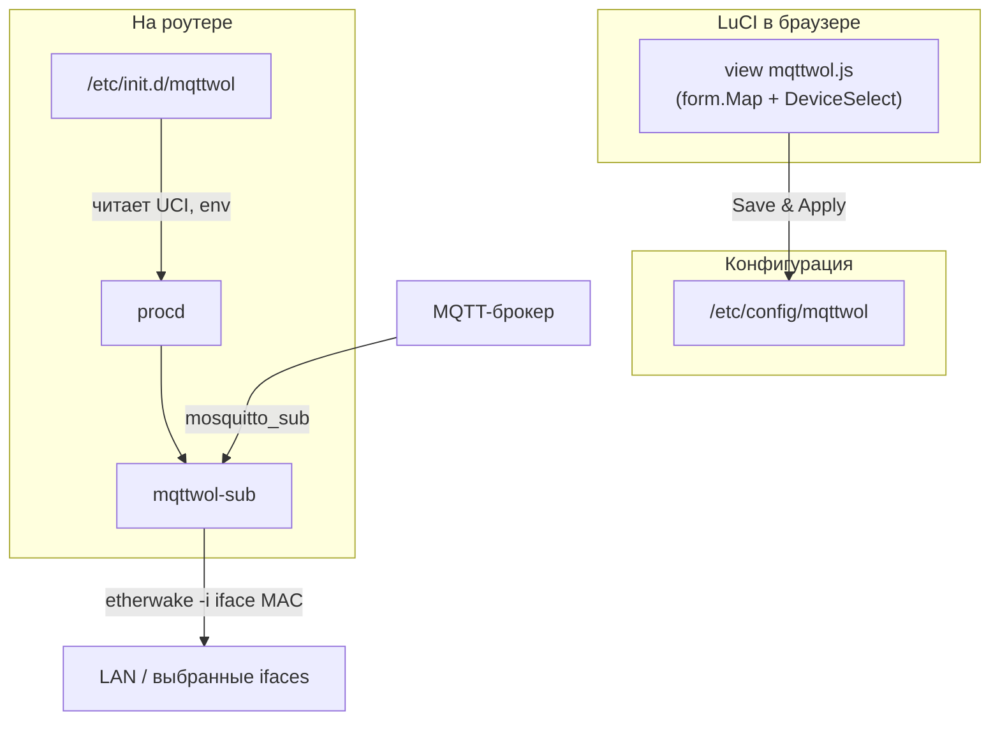

# luci-app-mqttwol

Пакет **OpenWrt / LuCI**: веб-настройка **`/etc/config/mqttwol`**, сервис **`procd`**, воркер **`mqttwol-sub`**. Подписка на MQTT-топик через **`mosquitto_sub`**, для каждой валидной строки-пейлоада (MAC) вызывается **`etherwake`** на выбранных сетевых интерфейсах.

Жёсткие зависимости: **`luci-base`**, **`mosquitto-client`**, **`etherwake`**.

---

## Как это устроено (схема)

### Блок-схема потоков



### ASCII (упрощённо)

```
  Браузер (LuCI)
       │  mqttwol.js: форма, DeviceSelect (много интерфейсов), флаг MQTT auth
       ▼
  /etc/config/mqttwol  (uci)
       │
  /etc/init.d/mqttwol  (procd)
       │  MQTTWOL_* env, список интерфейсов → MQTTWOL_INTERFACES
       ▼
  /usr/sbin/mqttwol-sub
       │  цикл: mosquitto_sub | read → wake
       ├──────────► MQTT broker
       └──────────► etherwake на каждом iface из списка
```

**Важно:** интерфейс LuCI — это **JavaScript view** (`form.Map`), а не старый Lua-CBI. Виджет **`widgets.DeviceSelect`** тот же по смыслу, что поле «Устройство» на странице сетевых интерфейсов OpenWrt (иконки, мосты, Wi‑Fi, псевдонимы `@…`, пользовательский ввод). Сохранённые значения — **имена устройств ядра** (например `br-lan`, `phy0-ap0`); в UCI они хранятся как **`list interface '…'`**.

---

## Поведение по шагам

1. **Пользователь** открывает **Services → MQTT Wake-on-LAN**, правит брокер, порт, топик, флаг **MQTT use authentication**, при необходимости логин/пароль, выбирает один или несколько интерфейсов в **Ethernet interfaces**, включает сервис и жмёт сохранение.
2. **`mqttwol.js`** при сохранении: если auth выключен — **удаляет** из UCI `username` и `password`; затем коммитит изменения и вызывает **`/etc/init.d/mqttwol restart`** (нужны права в ACL, см. ниже).
3. **`/etc/init.d/mqttwol`** при `enabled=1` собирает список интерфейсов из **`config_list_foreach main interface`** (и запасной вариант для старого `option interface`), для каждого элемента пытается **`network_get_physdev`** (OpenWrt `network.sh`); если логическое имя не резолвится — в список попадает строка как есть. В procd передаётся **`MQTTWOL_INTERFACES`** (через пробел).
4. **`mqttwol-sub`** в бесконечном цикле запускает **`mosquitto_sub`**, читает строки, нормализует и проверяет MAC, для каждого MAC вызывает **`etherwake -i <iface>`** для **каждого** интерфейса из **`MQTTWOL_INTERFACES`**. Логи: **`logread`**, тег **`mqttwol`**.
5. **`procd_add_reload_trigger mqttwol`** перезагружает сервис при изменении конфига `mqttwol` снаружи LuCI.

---

## Дерево репозитория (актуальное)

Корень **`luci-app-mqttwol-project`** — каталог для SDK/Docker и релизов; исходники приложения лежат во вложенной папке **`luci-app-mqttwol/`**.

```
luci-app-mqttwol-project/
├── README.md                    # этот файл
├── build-sdk-packages.sh        # сборка .apk / .ipk в Docker (OpenWrt SDK)
├── install.sh                   # установка последнего релиза с GitHub (apk/opkg)
├── .dockerignore
├── sdk/
│   ├── Dockerfile-sdk-apk-base
│   ├── Dockerfile-sdk-apk
│   ├── Dockerfile-sdk-ipk-base
│   └── Dockerfile-sdk-ipk
├── dist/sdk/                    # артефакты сборки (apk/, ipk/, опционально logs/)
└── luci-app-mqttwol/            # каталог пакета для feeds / SDK
    ├── Makefile
    ├── htdocs/luci-static/resources/view/mqttwol.js
    └── root/
        ├── etc/config/mqttwol
        ├── etc/init.d/mqttwol
        ├── usr/sbin/mqttwol-sub
        ├── usr/share/luci/menu.d/luci-app-mqttwol.json
        └── usr/share/rpcd/acl.d/luci-app-mqttwol.json
```

На устройстве дополнительно появляются:

- **`/www/luci-static/resources/view/mqttwol.js`**
- **`/usr/share/luci/menu.d/luci-app-mqttwol.json`**
- **`/usr/share/rpcd/acl.d/luci-app-mqttwol.json`**

Lua-контроллер и **`model/cbi`** в пакете **не используются** — меню и маршрут задаётся через **`menu.d`** и **`type: view`**.

---

## UCI: секция `config mqttwol 'main'`

| Параметр    | Тип / смысл |
|------------|-------------|
| `enabled`  | `1` — сервис активен under procd |
| `server`   | хост или IP брокера MQTT |
| `port`     | порт (по умолчанию в шаблоне `1883`) |
| `use_auth` | `1` — использовать логин/пароль для `mosquitto_sub` |
| `username` | логин (если `use_auth=1`) |
| `password` | пароль (если `use_auth=1`) |
| `topic`    | один топик подписки |
| `interface`| **`list`** — одно или несколько имён интерфейсов для `etherwake` |

Пейлоад MQTT: строка с MAC в виде `aa:bb:cc:dd:ee:ff` (допускается нормализация дефисов и регистра во воркере).

---

## ACL и меню

- Пункт меню зависит от **`acl: luci-app-mqttwol`** и наличия конфига **`uci: mqttwol`**.
- В ACL выданы чтение/запись **`uci` → `mqttwol`**, **`luci-rpc` → getNetworkDevices** (нужен для **DeviceSelect**), **`exec`** для **`/etc/init.d/mqttwol restart`** после сохранения формы.
- После установки пакета **`postinst`** выполняет **`/etc/init.d/rpcd reload`**, чтобы подхватить ACL. Профиль пользователя LuCI должен включать право **`luci-app-mqttwol`** (как и у других приложений `luci-app-*`).

---

## Сборка пакета

### Вариант A: Docker SDK (рекомендуется для релизов)

Требования: **Docker** (при отсутствии прав — запуск через **`sudo`**).

Из корня **`luci-app-mqttwol-project`**:

```sh
sudo ./build-sdk-packages.sh
```

Артефакты по умолчанию:

- **`dist/sdk/apk/luci-app-mqttwol-*.apk`**
- **`dist/sdk/ipk/luci-app-mqttwol_*.ipk`** (имя может отличаться суффиксом архитектуры)

Полезные опции:

| Опция | Назначение |
|--------|------------|
| `--out-dir <dir>` | каталог вывода вместо `./dist/sdk` |
| `--only-apk` | только APK (OpenWrt с пакетным менеджером apk) |
| `--only-ipk` | только IPK (opkg) |
| `--rebuild-base` | пересобрать базовый образ SDK с feeds |
| `--reset-builders` | пересоздать контейнеры-сборщики |
| `--enable-log` | писать лог в `logs/build-*.log` и дублировать вывод |

Повторные запуски **переиспользуют** кэшированные образы и контейнеры **`luci-app-mqttwol-sdk-*-builder`**, пока не указаны **`--rebuild-base`** / **`--reset-builders`**.

Переменная **`MAKE_VERBOSE`** задаёт уровень подробности `make` внутри контейнера (по умолчанию в скрипте используется непустое значение, см. `build-sdk-packages.sh`).

### Вариант B: полное дерево OpenWrt

Скопируйте каталог **`luci-app-mqttwol`** в **`package/`** или подключите как feed, установите зависимости feeds, в **`menuconfig`** включите **`luci-app-mqttwol`**, затем:

```sh
make package/luci-app-mqttwol/compile V=s -j"$(nproc)"
```

---

## Публикация и установка для пользователей

1. Соберите **apk** и/или **ipk** (см. выше).
2. Выложите файлы в **GitHub Releases** (или другой хостинг).
3. В **`install.sh`** проверьте URL API репозитория (`REPO_API`); при необходимости замените на свой org/repo.

Пример запуска установщика на роутере:

```sh
wget -O /tmp/install.sh https://raw.githubusercontent.com/YOUR_ORG/YOUR_REPO/main/install.sh
sh /tmp/install.sh
```

Переменная **`PKG_FMT=apk`** или **`PKG_FMT=ipk`** принудительно задаёт формат пакета; **`auto`** определяет по наличию **`apk`** / **`opkg`**.

Установка **`apk`** выполняется с **`--allow-untrusted`** для локальных/своих сборок (как в упрощённых скриптах вроде podkop).

---

## Проверка на роутере

- **`logread -f | grep mqttwol`** — события воркера.
- Тест MQTT: **`mosquitto_pub -h … -t <topic> -m '11:22:33:44:55:66'`** (подставьте свой топик и валидный MAC цели).
- Убедитесь, что выбранные интерфейсы действительно «смотрят» в ту L2-сеть, где живёт WoL-клиент.

Опционально на ПК сборки: **`shellcheck`** для **`mqttwol-sub`** и **`/etc/init.d/mqttwol`**.

---

## Замечания по безопасности и эксплуатации

- Логин и пароль MQTT в UCI передаются в **`mosquitto_sub`**; для незащищённых сетей лучше VPN или брокер с TLS и изоляция от WAN.
- Несколько интерфейсов увеличивают число magic packet’ов на одно сообщение MQTT (по одному проходу `etherwake` на интерфейс).
- Политики подписок с масками (`#`) в этом пакете не настраиваются — только один явный топик в UCI.

При добавлении функций поддерживайте этот файл в актуальном состоянии вместе с **`Makefile`** и **`mqttwol.js`**.
